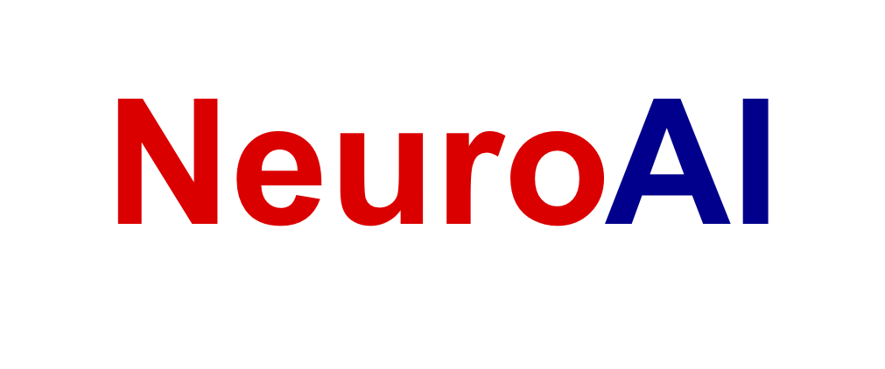

# University of Washington NeuroAI Seminar

Welcome to NeuroAI-UW seminar, a regular weekly seminar for UW community organized by [NeuroAI Shlizerman Lab](http://faculty.washington.edu/shlizee/).

Meetings are currently held virtually (Summer \& Fall 2020, Winter, Spring \& Fall 2021, Winter, Spring 2022). Contact us if you would like to join!
UW students can enroll into designated courses: AMATH 500L or EE 598F to participate in the seminarial activities.

New: We will be positing some of the invited visitors talks in <a href="https://youtube.com/playlist?list=PLT7UXiHHksMtU6SowO5BcXADFr271rltT" target="new">NeuroAI YouTube playlist</a>.
## 2022 Spring Schedule
Thanks [Ryan Vogt](https://amath.washington.edu/people/ryan-vogt) and Jingyuan Li for being the Student Organizers.
|    Date        | Paper/Activity | Student Presenter |
|----------------|-----------|----------|
| 04/01/2022     | Organizational & Intro Meeting |     |
| 04/08/2022     | [VICReg: Variance-Invariance-Covariance Regularization for Self-Supervised Learning](https://arxiv.org/abs/2105.04906) |  Kun Su, Mingfei Chen, Harsha Vardhan   |
|                | [The Causal-Neural Connection: Expressiveness, Learnability, and Inference](https://arxiv.org/abs/2107.00793) | Rahul Biswas, Shirui Chen, Xiulong Liu |
| 04/15/2022     | [ILQR-VAE : Control-base Learning of Input Driven Dynamics with Application To Neural Data](https://www.google.com/url?q=https://openreview.net/pdf?id%3DwRODLDHaAiW&sa=D&source=editors&ust=1649180753528118&usg=AOvVaw0JX_E5TNtKgSp882GqQfot) | Pamel Kang, Trung Le, Jingyuan Li    |
|                | [Neural Active Learning with Performance Guarantees](https://www.google.com/url?q=https://proceedings.neurips.cc/paper/2021/file/3dcaf04c357c577a857f3ffadc555f9b-Paper.pdf&sa=D&source=editors&ust=1649180753528261&usg=AOvVaw0ZeJ91Ndgrq4dqjGBRazlb) | Zhuochun Liu, Zhongshu Meng, Jinlin Xiang    |
| 04/22/2022     | [Inferring Latent Dynamics Underlying Neural Population aCTIVITY VIA neural Differential Equations](http://proceedings.mlr.press/v139/kim21h.html) | Michael Nolan, Saba H, Destiny Alvarado    |
|                | [Retriever: Learning Content-Style Representation as a Token-Level Bipartite Graph](https://arxiv.org/abs/2202.12307) | Yang Zheng, Anoop Mysore Nataraja, Malek Itani |
| 04/29/2022     | **Guest Speaker** [Kevin Xia](https://springo.github.io/) (Columbia University)

 |     |
| 05/06/2022     | [Towards Biologically Plausible Convolutional Networks](https://arxiv.org/abs/2106.13031) |  Xiangyu Gao, Yujia Liu, Xinyue Sun   |
|                | [Deep Reinforcement Learning with Spiking Q-Learning](https://arxiv.org/abs/2201.09754) |  Jingwei Xu, Miranda Anderson, Jimin Kim   |
| 05/13/2022     | A3D3 Speakers |     |
| 05/20/2022     | TBA |     |
| 05/27/2022     | **Guest Speaker** [Claudio Gentile](https://sites.google.com/view/cgentile) (Google)

 |     |
| 06/03/2022     | A3D3 Speakers |     |
| 06/10/2022     | **Guest Speaker** [Marine Schimel](https://hennequin-lab.github.io/people/schimel/) (Cambridge)

 |     |
## 2022 Winter Schedule
|    Date        | Paper/Activity | Student Presenter |
|----------------|-----------|----------|
| 01/14/2022     | Organizational Meeting |     |
| 01/21/2022     | [Where is all the nonlinearity: flexible nonlinear modeling of behaviorally relevant neural dynamics using recurrent neural networks](https://www.biorxiv.org/content/biorxiv/early/2021/09/06/2021.09.03.458628.full.pdf?__cf_chl_jschl_tk__=9y9bBSKDp3wPH6C_ZfnTHiVED4A5wU6TyMCal9VgQeI-1642564872-0-gaNycGzNCP0) | Michael Nolan, Saba Heravi, Ryan Vogt, Zekun Chen |
|                | [Drop, Swap, and Generate: A Self-Supervised Approach for Generating Neural Activity](https://arxiv.org/pdf/2111.02338.pdf) | Kun Su, Xiangyu Gang, Pamel Kang, Jingyuan Li |
| 01/28/2022     | [Neural Active Learning with Performance Guarantees](https://arxiv.org/pdf/2106.03243.pdf) | Xiulong Liu, James Hazelden, Jinlin Xiang, Liem Vu |
|                | [Dynamic Causal Modelling Revisited](https://www.sciencedirect.com/science/article/pii/S1053811917301568) | Rahul Biswas, Astitwa Sarthak Lathe, Trung Le |
| 02/04/2022     | **A3D3 NeuroAI**| |
|                |OpenLabCluster Demo |Jingyuan Li (UW ECE), Moishe Kesselman (UW CSE)|
|                |Detection of Sleep Spindles with FPGA| Xiaohan Liu (UW ECE), Aidan Yokuda (UW ECE)|
|                |Somatotopic representation of texture sensation in the primary somatosensory and motor cortices of mice| Megan Lipton (Purdue Neurobiology)|
| 02/11/2022     | **Guest Speaker** [Eva L. Dyer](https://dyerlab.gatech.edu/people/pi-profile/) (Gatech)

  | |
| 02/18/2022     |[Stabilizing Dynamical Systems via Policy Gradient Methods](https://arxiv.org/abs/2110.06418) |Jimin Kim, Mingfei Chen, Aidan Yokuda |
|                | [AugMax: Adversarial Composition of Random Augmentations for Robust Training](https://arxiv.org/abs/2110.13771) | Yang Zheng, Xiaohan Liu, Yujia Liu, Xinyue Sun|
| 02/25/2022     | **Guest Speaker** [Max Simchowitz](https://msimchowitz.github.io/) (MIT)

  | |
| 03/04/2022     | **A3D3 NeuroAI** | |
|                | Optimizing brain stimulation using deep learning | Seungbin Park (Purdue) |
|                | Quantifying the effect of stimulation protocols on rapid network connectivity inference | Tomohiro Ouchi (UW) |
|                | Modeling Neural Population Activity with Spatiotemporal Transformer | Trung Le (UW) |
| 03/11/2022     |  **Guest Speaker**: [Omid G. Sani](https://omidsani.com/) (USC)

| |
## 2021 Fall Schedule
|    Date        | Paper/Activity | Student Presenter |
|----------------|-----------|----------|
| 10/08/2021     | Organizational Meeting |     |
| 10/15/2021     | [Representation learning for neural population activity with Neural Data Transformers](https://arxiv.org/pdf/2108.01210.pdf) | Rahul Biswas, Jimin kim |
|                | [Deep Reinforcement Learning for Neural Control](https://arxiv.org/abs/2006.07352) | Ryan Vogt, Jinlin Xiang|
| 10/22/2021     | [A unified framework of online learning algorithms for training recurrent neural networks](https://arxiv.org/pdf/1907.02649.pdf) | Harsha Vardhan, James Hazelden |
|                | [Lyapunov-Guided Embedding for Hyper-parameter Selection in Recurrent Neural Networks]() | Kun Su, Michael Nolan |
| 10/29/2021     | [AL-SAR: Active Learning for Skeleton-based Action Recognition]() | Xiulong Liu, Syed M. Aun Haider |
|                | [How does it sound?]() | Jingyuan Li, Trung Le |
| 11/05/2021     | **Guest Speaker** [Xiulong liu](https://scholar.google.com/citations?user=e5GPhrMAAAAJ&hl=zh-CN) (UW)

 | |
|                | **Guest Speaker** [Jingyuan Li](https://scholar.google.com/citations?user=BEhp15IAAAAJ&hl=zh-CN) (UW)

 | |
| 11/12/2021     | **Guest Speaker**: [Chethan Pandarinath](https://bme.gatech.edu/bme/faculty/Chethan-Pandarinath) (Georgia Tech)

 | |
|                | **Guest Speaker**: [Joel Ye](https://joel99.github.io/) (CMU)

 | |
| 11/19/2021     | [Local Plasticity rules can learn deep representations using self-supervised contrastive predictions](https://arxiv.org/abs/2010.08262) | Yang Zheng, Saba Heravi | |
|                | [AI Choreographer: Music Conditioned 3D Dance Generation with AIST++](https://arxiv.org/abs/2101.08779) | Xiangyu Gao, Yonghun Lee | |
| 11/26/2021     | Thanksgiving Break | |
| 12/03/2021     | **Guest Speaker**: [Cristina Savin](https://as.nyu.edu/content/nyu-as/as/faculty/cristina-savin.html) (NYU)

 | |
|                | **Guest Speaker**: Owen Marschall (NYU) 

 | |

## 2021 Spring Schedule
|    Date        | Paper/Activity | Student Presenter |
|----------------|-----------|----------|
| 04/02/2021     | [Deep Graph Pose: a semi-supervised deep graphical model for improved animal pose tracking](https://www.biorxiv.org/content/10.1101/2020.08.20.259705v1.full.pdf) | Chuanmudi Qin, Xiulong Liu, Kun Su |
|                | [Backpropagation and the brain](https://www.nature.com/articles/s41583-020-0277-3) | Ben Francis, Felix Tse, Trung Le |
| 04/09/2021     | [Understanding self-supervised Learning Dynamics without Contrastive Pairs](https://arxiv.org/pdf/2102.06810.pdf) | Jingyuan Li, Ayesha Ghaffar, Zidan Luo |
|                | [Closed-Form Factorization of Latent Semantics in GANs](https://arxiv.org/pdf/2007.06600.pdf)  | Jingxi Yu, Xiangyu Gao, Yang Zheng |
| 04/16/2021     | **Guest Speaker**: [Anqi Wu](https://sites.google.com/site/anqiwuresearch/) (Columbia University)

 | |
| 04/23/2021     |   [Non-reversible Gaussian processes for identifying latent dynamical structure in neural data](https://proceedings.neurips.cc/paper/2020/file/6d79e030371e47e6231337805a7a2685-Paper.pdf)   |  Rahul Biswas, Ryan Vogt, Michael Nolan    |
|                |   [Modeling behaviorally relevant neural dynamics with a novel preferential subspace identification](https://www.nature.com/articles/s41593-020-00733-0)   | Saba Heravi, Astitwa Lathe, Yiren Wang, Jimin Kim     |
| 04/30/2021     | **Guest Speaker**: [Bolei Zhou](http://bzhou.ie.cuhk.edu.hk/) (The Chinese University of Hong Kong)

   |      |
| 05/07/2021     |   New Papers Discussion   |      |
| 05/14/2021     |   ICLR Paper Presentation   |      |
| 05/21/2021     |   No Meeting   |      |
| 05/28/2021     |   **Guest Speaker**: [Omid G. Sani](https://omidsani.com/) (USC)

   |      |
| 06/04/2021     |   **Guest Speaker**: [Yuandong Tian](https://yuandong-tian.com/) (Facebook)

    |      |

## 2021 Winter Schedule
|    Date        | Paper/Activity | Student Presenter |
|----------------|-----------|----------|
| 01/08/2021     | Organizational Meeting |        |
| 01/15/2021     | [Graph Convolutional Reinforcement Learning](https://arxiv.org/pdf/1810.09202.pdf) |   Jinlin Xiang, Trung Le     |
|                | [When Counterpoint Meets Chinese Folk Melody](https://papers.nips.cc/paper/2020/file/bae876e53dab654a3d9d9768b1b7b91a-Paper.pdf) | Haobo Zhang, Xiulong Liu, Kun Su |
| 01/22/2021     |[Gradient Starvation: A Learning Proclivity in Neural Networks](https://arxiv.org/pdf/2011.09468.pdf)  |  Ryan Vogt, Yang Zheng      |
|                |[Cliques of Neurons Bound into Cavities Provide a Missing Link between Structure and Function](https://www.frontiersin.org/articles/10.3389/fncom.2017.00048/full) | Michael Nolan, Ben Francis, Rahul Biswas | |
| 01/29/2021     | **Guest Speaker**: [Zhiyao Duan](http://www2.ece.rochester.edu/~zduan/) 

  |        |
| 02/05/2021     |[Temporal Spike Sequence Learning via Backpropagation for Deep Spiking Neural Networks](https://proceedings.neurips.cc/paper/2020/file/8bdb5058376143fa358981954e7626b8-Paper.pdf)  |    Jingyuan Li, Saba Heravi, Yetao Chen    |
|                |[Improved protein structure prediction using potentials from deep learning](https://www.nature.com/articles/s41586-019-1923-7) | Chris Yin, Jamie Park, Jimin Kim |
| 02/12/2021     |[Unsupervised Sound Separation Using Mixture Invariant Training](https://proceedings.neurips.cc/paper/2020/file/28538c394c36e4d5ea8ff5ad60562a93-Paper.pdf)  |  Kun Su, Jinlin Xiang, Zhichao Lei |
|                |[Deep Reinforcement Learning and its neuroscientific implications](https://www.sciencedirect.com/science/article/pii/S0896627320304682?casa_token=AglEbspNXSgAAAAA:mVqXGqsAJ2Bo80PBAhkBr2fhExZjtgqfoI2xCREN_4nQHTyovwZc1IoJgDiiLKflL6bETi-n1w) | Ben Francis, Trung Le, Saba Heravi |
| 02/19/2021     |  |        |
| 02/26/2021     | **Guest Speaker**: [Kathryn Hess Bellwald](https://people.epfl.ch/kathryn.hess) 

|        |
| 03/05/2021     | **Guest Speaker**: [Wenrui Zhang](https://scholar.google.com/citations?hl=en&user=Eod1ZQUAAAAJ&view_op=list_works&sortby=pubdate) 

|        |
| 03/12/2021     | **Guest Speaker**: [Mohammad Pezeshki](https://mohammadpz.github.io/) 

|        |
## 2020 Autumn Schedule
|    Date        | Paper/Activity | Student Presenter |
|----------------|-----------|----------|
| 10/02/2020     |    Organizational Meeting    |            |
| 10/09/2020     |  [Learning a Prior over Intent via Meta-Inverse Reinforcement Learning](http://proceedings.mlr.press/v97/xu19d.html)|    Yang Zheng, Rahul Biswas    |
|                | [Universality and Individuality in recurrent networks](https://arxiv.org/abs/1907.08549) |  Michael Nolan, Ben Francis  |   
| 10/16/2020     | [Unsupervised deep learning identifies semantic disentanglement in single inferotemporal neurons](https://arxiv.org/pdf/2006.14304.pdf) |  Jinlin Xiang, Ryan Vogt   |
|                | [Low-dimensional dynamics for working memory and time encoding](https://www.pnas.org/content/early/2020/08/27/1915984117) | Jimin Kim, Trung Le, David Babin  |
| 10/23/2020     | **Guest Speaker**: [Niru Maheswaranathan](https://niru.dev/) 

 |      |
| 10/30/2020     | [Rotational Dynamics Reduce Interference Between Sensory and Memory Represenatations](https://www.biorxiv.org/content/10.1101/641159v1) |  Jingyuan Li, Saba Heravi  | |
|                | [Foley Music: Learning to Generate Music from Videos](https://arxiv.org/pdf/2007.10984.pdf) |    Kun Su, Xiulong Liu    |
| 11/06/2020     | **Guest Speaker**: [Christopher Cueva](https://scholar.google.com/citations?user=BxLgolsAAAAJ&hl=en) 

    |       |
| 11/13/2020     |  No meeting  |      |
| 11/20/2020     | **Guest Speaker**: [Alexandra Libby](https://pni.princeton.edu/directory/alexandra-libby)    |
| 11/27/2020     | Thanksgiving Break - No meeting |        |
| 12/4/2020      |**Guest Speaker**:  [Irina Higgins](https://scholar.google.com/citations?user=YWVuCKUAAAAJ&hl=en) 

|  |
| 12/4/2020      | **Guest Speaker**: [Chuang Gan](http://people.csail.mit.edu/ganchuang/)  

     |        |
| 12/11/2020     | Research Video Updates |        |

## 2020 Summer Schedule
We are reading papers published in recent Top AI Conferences (CVPR 2020, ICML 2020)!
 

|    Date        | Paper | Keywords | Presenter | Presentation Link |
|----------------|-----------|----------|------------|---------|
| 7/30/2020 | [Improving the Gating Mechanism of Recurrent Neural Networks](https://proceedings.icml.cc/static/paper_files/icml/2020/5650-Paper.pdf) | RNN | [Ryan Vogt](https://amath.washington.edu/people/ryan-vogt) | [Google Slides](https://docs.google.com/presentation/d/196lcrl9bOWiq_usIpaQvHjqE3SAxcAUxs9swZSvs0Ak/edit?usp=sharing) |
|           | [Encoding Musical Style with Transformer Autoencoders](https://proceedings.icml.cc/static/paper_files/icml/2020/1363-Paper.pdf) |Music Generation | [Kun Su](https://kun-su.netlify.app) | [Google Slides](https://docs.google.com/presentation/d/1vWzDYE8bvuxjF2o4eUcAd5SSEwIJ98RS-usdbYocMGQ/edit?usp=sharing)|
| 8/6/2020  | [Controllable Orthogonalization in Training DNNs](https://openaccess.thecvf.com/content_CVPR_2020/papers/Huang_Controllable_Orthogonalization_in_Training_DNNs_CVPR_2020_paper.pdf)| Network Optimization | Yang Zheng | [Google Slides](https://docs.google.com/presentation/d/1nM0gH2Tw2MgeU5LGpXNNHIepn0yH_iX-uSx2VmydsOE/edit?usp=sharing) |
|           | [Π´nets: Deep Polynomial Neural Networks](https://openaccess.thecvf.com/content_CVPR_2020/papers/Chrysos_P-nets_Deep_Polynomial_Neural_Networks_CVPR_2020_paper.pdf)| Network Design | Jinlin Xiang | [Google Slides](https://docs.google.com/presentation/d/1T7cM-S69C_9NdDWuCKkiKe47UpPxZ6TF5zXgze3PsQI/edit?usp=sharing) |
| 8/13/2020 | [Forecasting Sequential Data Using Consistent Koopman Autoencoders](https://proceedings.icml.cc/static/paper_files/icml/2020/2620-Paper.pdf)| Time Series Prediction  | Saba Heravi | [Google Slides](https://docs.google.com/presentation/d/1-IOt_G4fVJS_Kpgy8fcgqqt-uuKhI2EWeaf1ngoM-5U/edit?usp=sharing) |
|           | [Learning to Combine Top-Down and Bottom-Up Signals in Recurrent Neural Networks with Attention over Modules](https://proceedings.icml.cc/static/paper_files/icml/2020/1698-Paper.pdf)| RNN | Jingyuan Li | [Google SLides](https://docs.google.com/presentation/d/13ku9LYve8pPqEa8wJd74z5HhQ1aWbfgvfoZPBVnjR1Q/edit?usp=sharing) |
| 8/20/2020 | [Disentangling and Unifying Graph Convolutions for Skeleton-Based Action Recognition](https://openaccess.thecvf.com/content_CVPR_2020/papers/Liu_Disentangling_and_Unifying_Graph_Convolutions_for_Skeleton-Based_Action_Recognition_CVPR_2020_paper.pdf)| Graph, Skeleton | Rahul Biswas | [Google Slides](https://docs.google.com/presentation/d/1VxSEehhLD5xcrnni_xDYx6NYmuUqGe0nQc_lfgcNgao/edit?usp=sharing) |
|           | [Do RNN and LSTM have Long Memory](https://proceedings.icml.cc/static/paper_files/icml/2020/956-Paper.pdf)| RNN | Jimin Kim | [Google Slides](https://docs.google.com/presentation/d/15oMIF0ZRSwZJ-yeCWchmAK7ABmCs_LvdMPSBNwJbZsM/edit?usp=sharing) |
| 8/27/2020 | [XtarNet: Learning to Extract Task-Adaptive Representation for Incremental Few-Shot Learning](https://proceedings.icml.cc/static/paper_files/icml/2020/6928-Paper.pdf) | Incremental Learning | [Kun Su](https://kun-su.netlify.app) | [Google Slides](https://docs.google.com/presentation/d/1j5YtunFXH6S8E7mJ5nVZx6taoLTTevGQQVZDe72yEZ8/edit?usp=sharing) |
|           | [Approximating Stacked and Bidirectional Recurrent Architectures with the Delayed Recurrent Neural Network](https://proceedings.icml.cc/static/paper_files/icml/2020/5744-Paper.pdf)| RNN | Saba Heravi | [Google Slides](https://docs.google.com/presentation/d/1_Ph4ug07J2JcmyjgMxGN-MlaCbaP_RzXozThG2zgkp0/edit?usp=sharing) |
| 9/3/2020  | [Transformers are RNNs: Fast Autoregressive Transformers with Linear Attention](https://proceedings.icml.cc/static/paper_files/icml/2020/2935-Paper.pdf)| RNN | [Ryan Vogt](https://amath.washington.edu/people/ryan-vogt) | [Google Slides](https://docs.google.com/presentation/d/1DWrUFrQGrBEiMHbWpSExIqWAPPXQQpijFsasdnt8V5M/edit?usp=sharing) |
|           | [Deep Isometric Learning for Visual Recognition](https://arxiv.org/pdf/2006.16992.pdf) | Network Design | Jimin | [Google Slides](https://docs.google.com/presentation/d/1-xuQN-RZ29RI7WohFnzAXSy4vRwcRTueTr3zJZV7EVM/edit?usp=sharing) |
| 9/10/2020 | [Self-supervised Equivariant Attention Mechanism for Weakly Supervised Semantic Segmentation](http://openaccess.thecvf.com/content_CVPR_2020/papers/Wang_Self-Supervised_Equivariant_Attention_Mechanism_for_Weakly_Supervised_Semantic_Segmentation_CVPR_2020_paper.pdf)| Weakly Supervised | Jinlin Xiang | [Google Slides](https://docs.google.com/presentation/d/1ecpTsXEBveNnKMWtJYBqFPsiJn5LwpKhAURKvudiV0Y/edit?usp=sharing) |
|           | [Towards Global Explanations of Convolutional Neural Networks with Concept Attribution](http://openaccess.thecvf.com/content_CVPR_2020/papers/Wu_Towards_Global_Explanations_of_Convolutional_Neural_Networks_With_Concept_Attribution_CVPR_2020_paper.pdf) | Interpretability | Jingyuan Li | [Google Slides](https://docs.google.com/presentation/d/1t1bH1p8r79Oqnix-YISy1bGWFQUtR-IsH63x5S4wCVw/edit?usp=sharing) |
| 9/17/2020 | [Low-rank Compression of Neural Nets: Learning the Rank of Each Layer](https://openaccess.thecvf.com/content_CVPR_2020/papers/Idelbayev_Low-Rank_Compression_of_Neural_Nets_Learning_the_Rank_of_Each_CVPR_2020_paper.pdf)| Compression | Rahul Biswas | [Google Slides](https://docs.google.com/presentation/d/125nmKFyltUohekqHHGuvN9h_svzr_x7L4ATYRoVYOlQ/edit?usp=sharing) |
|           | [Sign Language Transformers: Joint End-to-end Sign Language Recognition and Translation](https://arxiv.org/pdf/2003.13830.pdf) | | Yang Zheng | [Google Slides](https://docs.google.com/presentation/d/1ojCGV8xvls5IXiLvisPX1HKm-vLguC-HR2cbEVBSlPY/edit?usp=sharing) |

